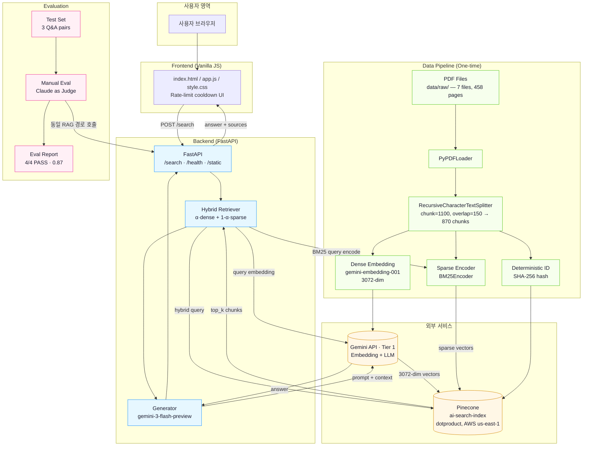
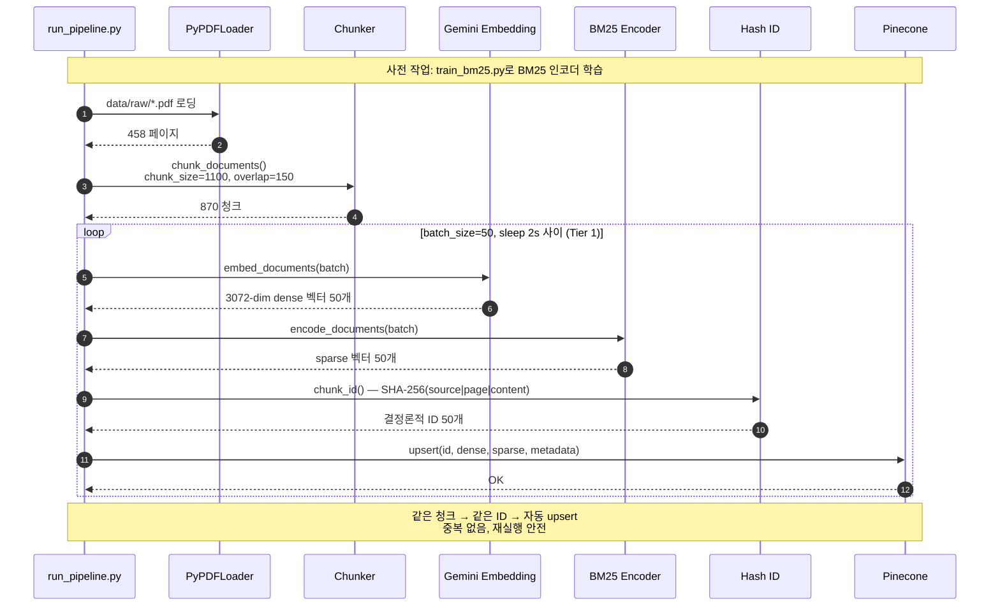
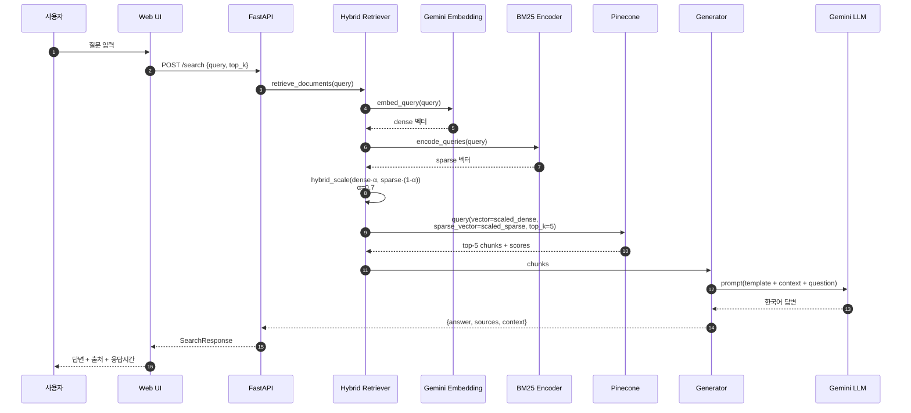
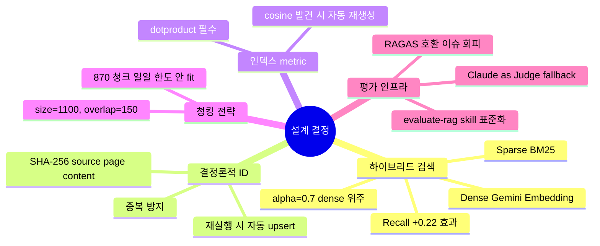

# 시스템 아키텍처 — RAG AI 용어 & 트렌드 검색

> 본 문서는 본 프로젝트의 데이터 흐름·구성 요소·외부 의존성을 시각화합니다. 다이어그램은 모두 Mermaid로 작성되었습니다.
> **현재 검색 방식: 하이브리드 (Dense + BM25 Sparse)**

---

## 1. 전체 아키텍처 (High-Level)

---

## 2. 데이터 인덱싱 흐름 (Phase 2 — Hybrid)

---

## 3. 검색 + 답변 생성 흐름 (Hybrid Query Path)

---

## 4. 평가(LLM-as-Judge) 흐름

```mermaid
flowchart LR
    TS[Test Set N=3<br/>question + ground_truth] --> RAG[Hybrid RAG<br/>retrieve + generate]
    RAG --> DATA[output/eval_data.json<br/>question·contexts·answer·GT]
    DATA --> JUDGE[Claude as Judge<br/>Claude Code 대화창]
    JUDGE --> SCORE[4 Metrics<br/>F=0.94 · AR=0.91 · CP=0.82 · CR=0.82]
    SCORE --> AGG[종합 평균 0.87 · 4/4 PASS]
    AGG --> RPT[Reports<br/>ragas_evaluation_report.md<br/>rag_eval_agent_report.md]

    classDef data fill:#fff7e6,stroke:#d48806
    classDef proc fill:#e6f7ff,stroke:#1890ff
    classDef out fill:#f6ffed,stroke:#52c41a

    class TS,DATA data
    class RAG,JUDGE,AGG proc
    class SCORE,RPT out
```

---

## 5. 컴포넌트 책임 매트릭스

| 컴포넌트 | 파일 | 책임 |
|----------|------|------|
| PDF Loader | `src/pipeline/loader.py` | `data/raw/` 내 PDF 로딩, 페이지 단위 Document 변환 |
| Chunker | `src/pipeline/chunker.py` | 청크 분할 (size=1100, overlap=150, 한국어 분리자 포함) |
| **Hybrid Indexer** | `src/pipeline/indexer.py` | Dense 임베딩 + BM25 sparse + 결정론적 해시 ID + Pinecone upsert |
| BM25 Trainer | `scripts/train_bm25.py` | 전체 코퍼스에서 IDF 통계 학습, `output/bm25_encoder.pkl` 저장 |
| Index 생성 | `scripts/create_index.py` | dotproduct 인덱스 자동 생성/재생성 (cosine 발견 시 삭제 후 dotproduct로) |
| Index 정리 | `scripts/clear_index.py` | 인덱스 내 모든 벡터 삭제 (인덱스는 유지) |
| **Hybrid Retriever** | `src/rag/retriever.py` | dense·α + sparse·(1-α) 가중 결합 후 Pinecone 쿼리 |
| Generator | `src/rag/generator.py` | 프롬프트 구성 + Gemini LLM 호출 + 결과 가공 |
| API | `src/api/main.py`, `schemas.py` | FastAPI: `/search`, `/health`, `/`, `/static`. 429 응답 시 retry_seconds 반환 |
| Frontend | `frontend/index.html` 외 | 검색 UI + Cooldown 카운트다운 (rate-limit 시) |
| Eval (Collect) | `src/eval/collect_eval_data.py` | 데이터만 수집해 JSON 저장 |
| Eval (Manual) | `src/eval/manual_eval.py` | Gemini judge 또는 Claude judge로 4지표 채점 |

---

## 6. 외부 의존성 (Tier 1)

| 서비스 | 용도 | 한도(Tier 1) | 비고 |
|--------|------|-------------|------|
| Gemini Embedding (`gemini-embedding-001`) | 청크/쿼리 임베딩 | ~1500 RPM, 일일 사실상 무제한 | $0.000025/1K chars |
| Gemini LLM (`gemini-3-flash-preview`) | 답변 생성 | ~1000 RPM | preview 모델 |
| Pinecone Serverless | Vector DB (dotproduct, hybrid) | Free tier 사용량 내 | 2GB Storage / 1M RU / 2M WU |

---

## 7. 핵심 설계 결정사항

---

## 8. RAGAS 호환성 이슈 (참고)

| 이슈 | 원인 | 우회 |
|------|------|------|
| RAGAS 0.2.6 evaluate() NaN | langchain-google-genai 2.x async path가 `temperature` kwarg를 gRPC client에 직접 전달 | LLM-as-Judge 수동 평가로 대체 |
| Free tier 일일 한도 | Embedding 1000/day, LLM 5/min | Tier 1 전환 |

자세한 내용은 `ragas_evaluation_report.md` §1-1 참조.
