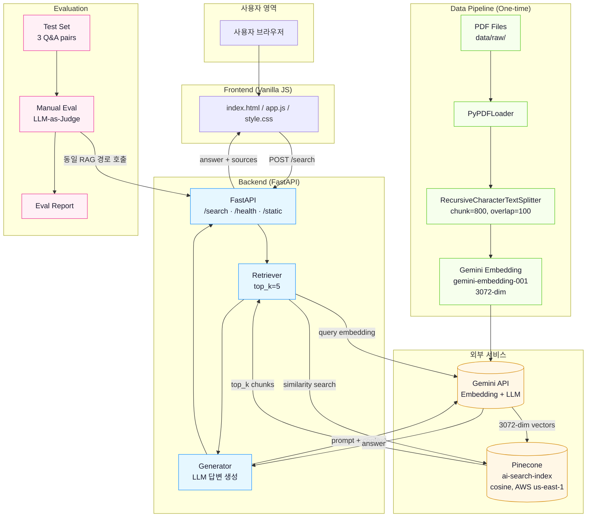
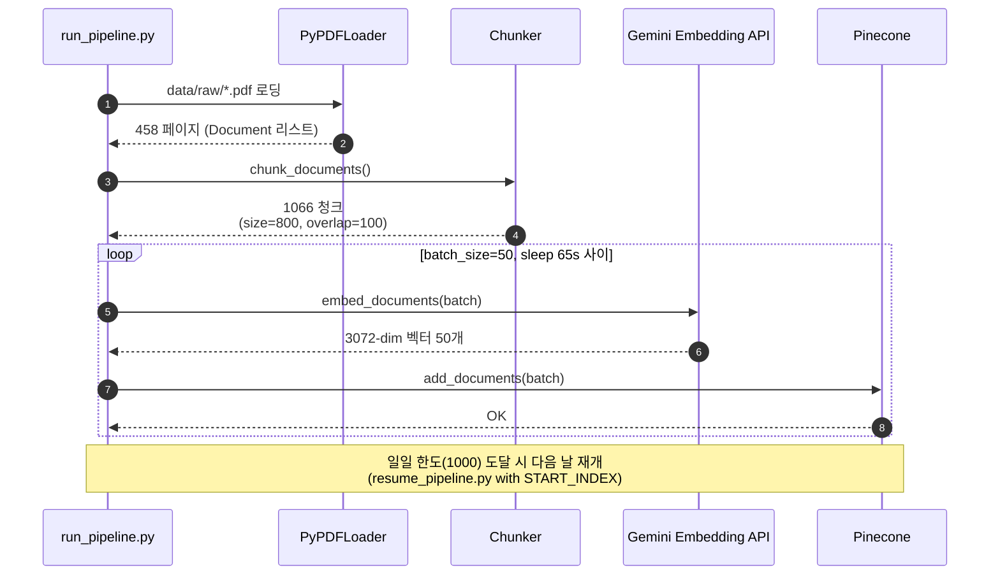
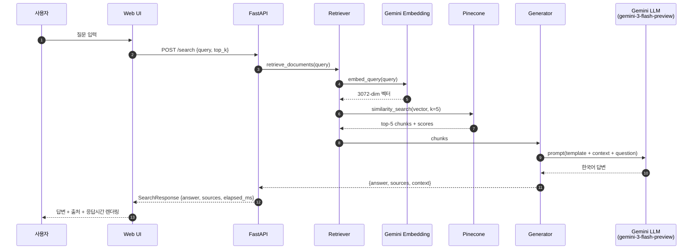
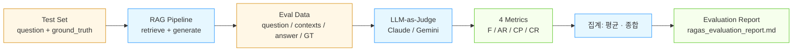
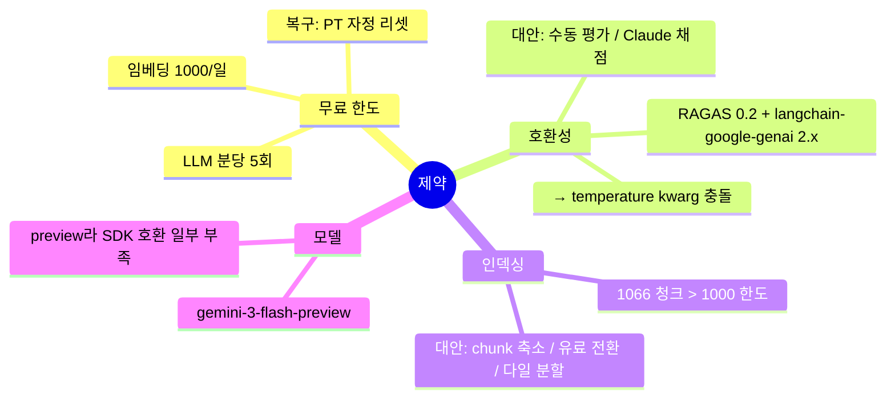

# 시스템 아키텍처 — RAG AI 용어 & 트렌드 검색

> 본 문서는 본 프로젝트의 데이터 흐름·구성 요소·외부 의존성을 시각화합니다. 다이어그램은 모두 Mermaid로 작성되었습니다.

---

## 1. 전체 아키텍처 (High-Level)

---

## 2. 데이터 인덱싱 흐름 (Phase 2)

---

## 3. 검색 + 답변 생성 흐름 (Query Path)

---

## 4. 평가(LLM-as-Judge) 흐름 (Phase 5)

---

## 5. 컴포넌트 책임 매트릭스

| 컴포넌트 | 파일 | 책임 |
|----------|------|------|
| PDF Loader | `src/pipeline/loader.py` | `data/raw/` 내 PDF 로딩, 페이지 단위 Document 변환 |
| Chunker | `src/pipeline/chunker.py` | 청크 분할 (size=800, overlap=100, 한국어 분리자 포함) |
| Indexer | `src/pipeline/indexer.py` | Pinecone 업로드, 배치/Rate Limit 재시도 |
| Index 생성 | `scripts/create_index.py` | 인덱스 초기화 (3072-dim, cosine, AWS us-east-1) |
| Retriever | `src/rag/retriever.py` | 쿼리 임베딩 → similarity search |
| Generator | `src/rag/generator.py` | 프롬프트 구성 + Gemini LLM 호출 + 결과 가공 |
| API | `src/api/main.py`, `src/api/schemas.py` | FastAPI: `/search`, `/health`, `/`, `/static` |
| Frontend | `frontend/index.html` 외 | 검색 UI, fetch POST, 답변·출처·응답시간 표시 |
| Eval (Manual) | `src/eval/manual_eval.py` | Gemini judge용 평가 (분당 5회 한도 대응) |
| Eval (Collect) | `src/eval/collect_eval_data.py` | 데이터만 수집해 JSON 저장, 채점은 외부 |
| Eval (Claude) | Claude Code 대화창 | LLM-as-Judge 채점 (Anthropic API 미사용) |

---

## 6. 외부 의존성

| 서비스 | 용도 | 한도(Free Tier) | 비고 |
|--------|------|----------------|------|
| Gemini Embedding (`gemini-embedding-001`) | 청크/쿼리 임베딩 | 1000 req/day | 일일 한도가 인덱싱 시 병목 |
| Gemini LLM (`gemini-3-flash-preview`) | 답변 생성 | 분당 한도 별도 | 본 답변 모델 |
| Gemini LLM (`gemini-2.5-flash`) | RAGAS judge (호환 이슈로 사용) | 5 req/min | RAGAS 0.2 + langchain-google-genai 2.x 호환 이슈로 NaN |
| Pinecone Serverless | Vector DB | 2GB Storage / 1M RUs / 2M WUs | 본 프로젝트 사용량 무료 한도 내 |

---

## 7. 알려진 제약사항

