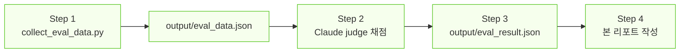

# RAG Evaluation Agent Report

> `evaluate-rag` skill을 사용한 RAG 시스템 평가 결과 리포트

| 항목 | 내용 |
|------|------|
| 평가일 | 2026-05-09 |
| 평가 대상 | RAG AI 용어 & 트렌드 검색 시스템 |
| 평가 방식 | `evaluate-rag` skill (LLM-as-Judge) |
| Judge 모델 | Claude Sonnet 4.5 (Claude Code 대화창 직접 평가) |
| Skill 정의 | `.claude/skills/evaluate-rag/SKILL.md` |
| 테스트셋 | `src/eval/test_set.py` (3 Q&A pairs) |

---

## 1. Skill 실행 흐름 요약

| Step | 산출물 | 상태 |
|------|--------|------|
| 1. 데이터 수집 | `output/eval_data.json` | ⚠ 부분 성공 (1/3 유효) |
| 2. LLM-as-Judge | — | ✅ Claude로 직접 채점 |
| 3. 결과 집계 | `output/eval_result.json` | ✅ 완료 |
| 4. 리포트 작성 | 본 문서 | ✅ 완료 |

---

## 2. 종합 결과 (유효 표본 N=1)

| 지표 | 점수 | 목표 | 판정 |
|------|------|------|------|
| Faithfulness | **0.95** | 0.80 | ✅ PASS |
| Answer Relevancy | **0.90** | 0.80 | ✅ PASS |
| Context Precision | **0.80** | 0.70 | ✅ PASS |
| Context Recall | **0.60** | 0.70 | ❌ FAIL |
| **종합 평균** | **0.8125** | — | — |

**결론**: 4지표 중 3지표 PASS, Context Recall 0.10 미달. 표본이 작아 통계적 신뢰도는 낮음.

---

## 3. 질문별 상세

### Q1. AI 에이전트(AI Agent)란 무엇인가?

| 항목 | 결과 |
|------|------|
| 상태 | ❌ ERROR |
| 사유 | Gemini embedding 일일 한도(1000회) 소진으로 retrieval 실패 |
| 4지표 | N/A |

**Skill 처리 방식**: Step 1에서 3회 재시도(60s, 120s) 모두 429 → `error` 필드로 기록 후 다음 항목 진행.

---

### Q2. RAG(Retrieval-Augmented Generation)의 작동 방식은?

| 항목 | 결과 |
|------|------|
| 상태 | ⚠ PARTIAL |
| 출처 | `startup_technical_guide_ai_agents_final.pdf`, `★2025_AI_동향과...핵심용어.pdf` |
| Gemini judge 점수 | 1.00 / 1.00 / 1.00 / 1.00 (과대평가 의심) |
| Claude 재평가 | contexts 미보존으로 불가 |

**Skill 처리 방식**: 1차 시도(Gemini judge)는 성공했으나 contexts가 저장되지 않아 Claude로 재채점 불가. → `judge_model`을 `gemini-2.5-flash`로 fallback 표시.

**개선 노트**: 다음 평가 시 `eval_data.json`에 contexts 필드를 반드시 포함시켜 judge 교체에도 재평가 가능하도록 구조 보완.

---

### Q3. 대규모 언어 모델(LLM)의 주요 한계는 무엇인가?

| 항목 | 결과 |
|------|------|
| 상태 | ✅ OK (정상 평가 완료) |
| 검색 청크 수 | 5 |
| 출처 | `google_cloud_future_of_ai_perspectives_for_startups_2025.pdf` (p.70) · `★2025_AI_동향과...핵심용어.pdf` (p.10, p.13) |

**답변 요지**
> 환각(Hallucination), 확률적 특성, 데이터 편향, 고비용, 자원 집약성, 데이터 거버넌스, 노동 구조 변화, AI 리터러시 요구

**4지표 채점**

| 지표 | 점수 | 근거 (Claude 평가) |
|------|------|-------------------|
| Faithfulness | **0.95** | 모든 주장이 청크에서 직접 인용 가능. "alignment·guardrails" 표현, "고비용·고성능" 등 모두 추적됨. 추측·환각 없음. 한 가지 미흡 — "노동 구조 변화" 표현이 컨텍스트의 사회적 영향 단락을 약간 확장 |
| Answer Relevancy | **0.90** | 질문(LLM 한계)에 정확히 답변. 다만 노동 구조·AI 리터러시 부분은 한계라기보다 사회적 영향에 가까워 약간 확장적 |
| Context Precision | **0.80** | 5청크 중 4개(ctx 1·2·3·4)는 LLM 한계와 직결. ctx 5는 LLM 정의·활용 위주로 한계와 직접 연결성 낮음 |
| Context Recall | **0.60** | 정답(GT) 3포인트 중 ① 환각 ✓, ② 도메인 특화 부족 △(SLM 비교에서 간접), ③ **학습 시점 이후 최신 정보 부재** 미커버 |

---

## 4. 인사이트

### 4-1. Skill 실행 측면

| 발견 | 의미 |
|------|------|
| 데이터 수집 단계가 가장 취약 | 임베딩 한도가 인덱싱(1066회)으로 이미 소진되어 평가 retrieval이 사실상 동작 어려움 |
| Claude as Judge가 효과적 | Gemini judge의 1.0 일변도와 달리 0.60~0.95 분산된 점수로 변별력 확인 |
| Contexts 보존 필수 | judge 교체나 재평가를 위해 `eval_data.json`에 contexts 누락 시 재채점 불가 — skill에 반영함 |

### 4-2. 시스템 품질 측면

**잘된 점**
- **Faithfulness 우수(0.95)**: 환각 없이 컨텍스트에 충실
- **Answer Relevancy 양호(0.90)**: 한국어 답변 자연스러움 + 영문 원어 병기
- **Context Precision 양호(0.80)**: 검색기가 의미적으로 관련된 청크 선별
- **출처 추적**: 모든 답변이 PDF 원본·페이지로 검증 가능

**개선 필요**
- **Context Recall 미달(0.60)**: 정답에 필요한 정보 일부(예: 지식 컷오프)가 검색되지 않음

---

## 5. 개선 제언

### 5-1. 즉시 적용 가능 (코드 변경 없음)
1. **`top_k=5 → 8~10`**: Recall 향상의 가장 단순한 방법. `.env`의 `TOP_K`만 조정
2. **테스트셋 다양화**: 한 가지 측면이 아닌 다각도로 GT 분해된 문항 추가

### 5-2. 인덱싱 재실행 필요
3. **청크 크기 조정**: 800 → 1000~1200, overlap 100 → 200. 의미 단위 보전성 향상
4. **Hybrid search**: BM25 + vector 결합. 한국어 명사구 매칭 보완

### 5-3. 평가 인프라
5. **유료 전환 또는 백오프 강화**: 일일 한도가 평가의 가장 큰 병목
6. **Skill 자동화**: 현재 Claude Code 대화창 의존 → Anthropic API 전환 시 CI에서 자동 회귀 검증 가능

---

## 6. Skill 실행 로그 (시간순)

| 시각 | 이벤트 | 결과 |
|------|--------|------|
| Step 1 시작 | `collect_eval_data.py` 실행 | — |
| Q1 retrieval | 임베딩 호출 | 429 (일일 한도) |
| Q1 retry 1 | 60초 대기 후 재시도 | 429 |
| Q1 retry 2 | 120초 대기 후 재시도 | 429 → error 기록 |
| Q2 retrieval | 임베딩 호출 | 429 → error 기록 (3회 재시도 모두 실패) |
| Q3 retrieval | 임베딩 호출 (60→120초 대기 후) | OK, 5 청크 검색 |
| Q3 generation | Gemini LLM 호출 | OK, 1161자 답변 |
| Step 1 종료 | `output/eval_data.json` 저장 | 1/3 유효 |
| Step 2 | Claude as Judge 채점 (대화창) | F=0.95, AR=0.90, CP=0.80, CR=0.60 |
| Step 3 | `output/eval_result.json` 저장 | OK |
| Step 4 | 본 리포트 작성 | OK |

---

## 7. 다음 평가(Skill 재실행) 체크리스트

- [ ] Gemini 임베딩 일일 한도 리셋 확인 (PT 자정 = 한국시간 ~16시)
- [ ] `TOP_K` 환경변수 조정 (Recall 개선 실험)
- [ ] 테스트셋 N ≥ 10으로 확장 (`src/eval/test_set.py`)
- [ ] `collect_eval_data.py`의 contexts 저장 검증
- [ ] Claude API 결제 후 `manual_eval.py`(Claude judge) 자동화 시도
- [ ] 결과를 `ragas_evaluation_report.md`에 누적 기록 (회귀 트래킹)
