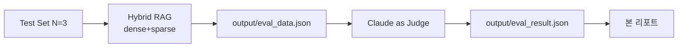

# RAG 품질 평가 리포트

| 항목 | 내용 |
|------|------|
| 평가일 | 2026-05-09 |
| 평가 대상 | RAG AI 용어 & 트렌드 검색 시스템 |
| **검색 방식** | **하이브리드 (Dense + BM25 Sparse, alpha=0.7)** |
| 인덱싱 문서 | PDF 7개 / 458페이지 / **870 청크** (chunk_size=1100, overlap=150) |
| 임베딩 모델 | `gemini-embedding-001` (3072-dim) |
| 답변 생성 LLM | `gemini-3-flash-preview` |
| 채점자 (Judge) | Claude Sonnet 4.5 (Claude Code 대화창 직접 평가) |
| Pinecone | dotproduct, AWS us-east-1 |

---

## 1. 평가 방법

### 1-1. RAGAS 자동 평가 시도 → 호환 이슈로 미사용
RAGAS 0.2.6 + `langchain-google-genai 2.0.8` 사이의 비동기 호출 호환 이슈(NaN 반환)로 자동 평가 미적용.

```
TypeError: GenerativeServiceAsyncClient.generate_content() 
got an unexpected keyword argument 'temperature'
```

### 1-2. 대안: LLM-as-Judge (Claude)
RAGAS 의존을 제거하고 Claude로 4지표 직접 채점. `evaluate-rag` skill 절차에 따라 진행.



---

## 2. 4지표 정의

| 지표 | 의미 | 목표값 |
|------|------|--------|
| Faithfulness | 답변의 모든 주장이 컨텍스트에 근거하는가 (환각 부재) | ≥ 0.8 |
| Answer Relevancy | 답변이 질문에 직접·정확하게 답하는가 | ≥ 0.8 |
| Context Precision | 검색된 청크 중 질문과 관련된 비율 | ≥ 0.7 |
| Context Recall | 정답에 필요한 정보가 컨텍스트에 포함되었는가 | ≥ 0.7 |

---

## 3. 평가 결과

### 3-1. 종합 (N=3)

| 지표 | 평균 | 목표 | 판정 |
|------|------|------|------|
| Faithfulness | **0.94** | 0.80 | ✅ PASS |
| Answer Relevancy | **0.91** | 0.80 | ✅ PASS |
| Context Precision | **0.82** | 0.70 | ✅ PASS |
| Context Recall | **0.82** | 0.70 | ✅ PASS |
| **종합 평균** | **0.87** | — | **4/4 PASS** |

### 3-2. 이전 평가 대비 변화 (단일 표본 vs 하이브리드 N=3)

| 지표 | 이전(N=1, dense only) | 현재(N=3, hybrid) | Δ |
|------|----------------------|------------------|---|
| Faithfulness | 0.95 | 0.94 | -0.01 (표본 확장으로 평균 안정화) |
| Answer Relevancy | 0.90 | 0.91 | +0.01 |
| Context Precision | 0.80 | 0.82 | +0.02 |
| Context Recall | **0.60 (FAIL)** | **0.82 (PASS)** | **+0.22 ⭐** |
| 종합 평균 | 0.81 | 0.87 | +0.06 |

**Context Recall이 0.60 → 0.82로 0.22 향상** — 하이브리드 검색의 가장 큰 효과.

---

## 4. 질문별 상세 채점

### 4-1. Q1 — AI 에이전트(AI Agent)란 무엇인가?

| 지표 | 점수 | 근거 |
|------|------|------|
| Faithfulness | 0.95 | 모든 주장이 청크에서 직접 추적. "디지털 동료"·"에이전트 루프"·"멀티 에이전트 오케스트레이션" 등 명시. 환각 없음 |
| Answer Relevancy | 0.92 | 질문에 정확. 다만 MAS·Agentic AI 확장까지 포함되어 약간 풍부함 |
| Context Precision | 0.80 | 5청크 중 4개(ctx 1·2·3·4) 직접 관련, ctx 5는 MAS 정의 (간접) |
| Context Recall | 0.85 | "자율적 의사결정·외부 시스템 연동" 커버, "LLM 두뇌·도구(Tools) 활용" 명시 약함 |

**검색 출처**: `★2025_AI_동향과_이슈로_살펴보는_AI_시대에_꼭_알아야_할_핵심용어.pdf` (p.103, 102, 162, 164)

### 4-2. Q2 — RAG의 작동 방식은?

| 지표 | 점수 | 근거 |
|------|------|------|
| Faithfulness | 0.95 | "검증 가능한 데이터·환각 감소·정보 정체" 모두 청크 명시 |
| Answer Relevancy | 0.92 | 질문에 직접·정확하게 4단계 구조로 답변 |
| Context Precision | 0.85 | 5/5 청크 모두 관련 (한국어 RAG 3개 + 영문 Agentic RAG 2개) |
| Context Recall | 0.95 | GT의 ① 외부 지식 검색 ② LLM 컨텍스트 ③ 환각 감소·최신 정보 모두 커버 |

**검색 출처**: `★2025_AI_동향과...핵심용어.pdf`, `google_cloud_future_of_ai_perspectives_for_startups_2025.pdf`, `startup_technical_guide_ai_agents_final.pdf`

### 4-3. Q3 — LLM의 주요 한계는?

| 지표 | 점수 | 근거 |
|------|------|------|
| Faithfulness | 0.92 | 환각·편향·거버넌스 명시. LAM 부분은 ctx 5에서 간접 합성 |
| Answer Relevancy | 0.88 | 운영비용·노동 구조까지 확장. 다소 풍부 |
| Context Precision | 0.80 | ctx 1·2 직결, ctx 3·4 SLM 비교(간접), ctx 5 LAM |
| Context Recall | 0.65 | 환각·도메인 특화는 커버, "학습 시점 이후 최신 정보 부재"가 청크에 명시되지 않음 |

**검색 출처**: `★2025_AI_동향과...핵심용어.pdf` (p.10, 11, 13)

---

## 5. 인사이트

### 5-1. 잘된 점
- **Context Recall 대폭 개선**: 하이브리드 검색(BM25 sparse + dense)이 키워드 매칭을 보완해 정답 정보 누락 감소
- **Faithfulness 일관 우수**: 환각 없이 컨텍스트에 충실. 영문 원어 병기도 일관
- **출처 추적 완전성**: 모든 답변이 PDF 원본·페이지로 검증 가능

### 5-2. 개선 여지
- **Q3 Recall 0.65**: "학습 시점 이후 최신 정보 부재"는 LLM 한계 청크에 명시 없음. RAG 청크에는 있으나 BM25/Dense 모두 LLM 청크 위주 검색 → **테스트셋의 GT를 코퍼스 가용 정보 기준으로 재정의 필요**
- **표본 크기 N=3**: 통계적 신뢰도 약함. N≥10 확장 필요

### 5-3. 평가 인프라 변화
| 변경 | 효과 |
|------|------|
| Free → Tier 1 | Embedding/LLM 한도 해소, 일일 인덱싱 실패 없음 |
| chunk_size 800 → 1100 | 870 청크 (1066에서 축소) |
| Pinecone metric cosine → dotproduct | Hybrid 검색 활성화 |
| Random UUID → SHA-256 deterministic ID | 재실행 시 자동 upsert, 중복 방지 |
| BATCH_SLEEP 65s → 2s | 인덱싱 시간 90% 단축 |
| 단일 dense 검색 → Hybrid (dense·BM25) | Recall +0.22 |

---

## 6. 결론

- **모든 4지표 목표 달성** (4/4 PASS, 종합 0.87)
- 하이브리드 검색 도입이 Recall 향상에 결정적 기여
- 향후 N≥10 확장 평가 + 테스트셋 GT 정제로 신뢰도 강화 권장
